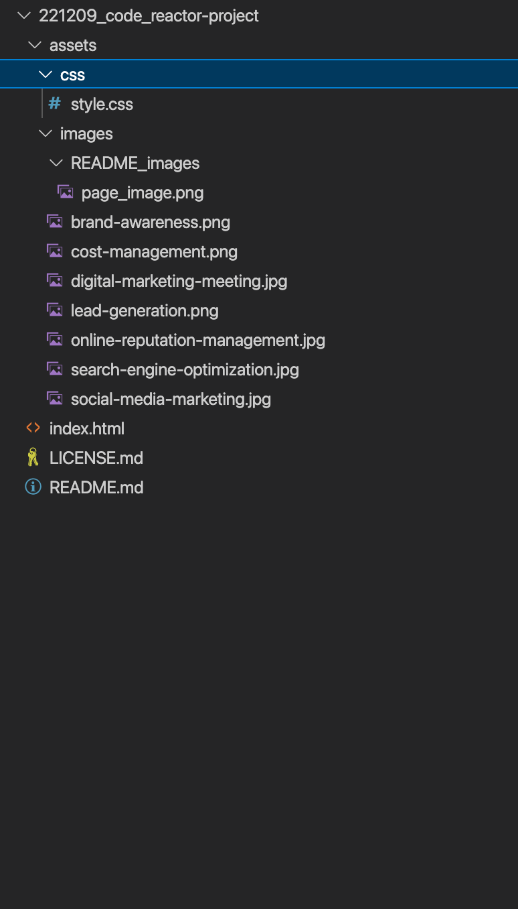

# 221209_code_reactor-project

## Description 

This Simple Webpage was a Code reactor Student Project for Bootcamp. The Client is looking to increase the accessability of their webpage, by using Semantic HTML elements. However keeoing the functionality of the page, aesthetics and polished user interface. This Pge contains HTML and CSS compontents with an example of the landing screen below

https://tjhandson.github.io/221209_code_reactor-project/

## Installation

# Web browser - Chrome
To View the finished webpage downloading a Web browser, such as google chrome, is recomended. Please find the link too download below: https://www.google.co.uk/chrome/?brand=YTUH&gclid=EAIaIQobChMI5pKQxIr2-wIVwp7tCh3CoA27EAAYASAAEgI4jfD_BwE&gclsrc=aw.ds

With the instalation process noted below: https://support.google.com/chrome/answer/95346?hl=en-GB&co=GENIE.Platform%3DDesktop

However to view code and images 

# Git 
It is recomented to download Git if you are looking to interact with this public repo, Details on downloading this can be found here: https://github.com/git-guides/install-git

# VS Code
Visual Studio Code is a source-code editor (there are others available), The download for this cn be found on; https://code.visualstudio.com/download

## Usage 
This is a public repo and available to be run on either a webrowser or locally. 

# Run on Wb browser
Follow the link on: https://tjhandson.github.io/221209_code_reactor-project/

# Run Locally 

Clone project
git clone git@github.com:tjhandson/prework-study-guide.git
cd 221209_code_reactor-project

Once downloaded the follow assers should be available within this folder:

## Credits

All original Sourse material and images were provided by © 2022 edX Boot Camps LLC.

## License

MIT License 2022 Please refer to the LICENSE in the repo.

## Contributing

---

© 2022 edX Boot Camps LLC. Confidential and Proprietary. All Rights Reserved.
